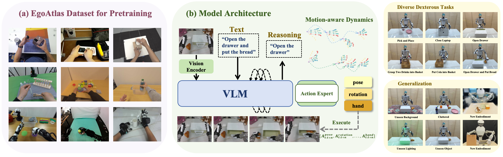
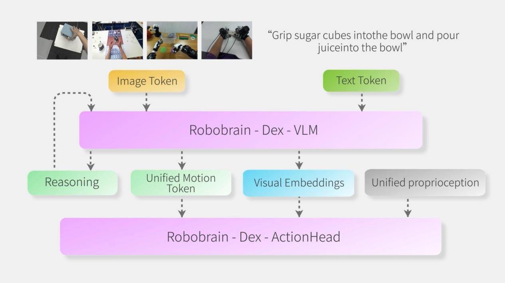

# RoboBrain-Dex: Multi-Source Egocentric Training for Integrated Dexterous Vision-Language-Action Model 

<div align="center">

[](https://aureleopku.github.io/METIS/)
[](https://arxiv.org/abs/2511.17366)
<!--[](./LICENSE) -->
</div>

<div align="center">
       <video src="https://github.com/user-attachments/assets/b3fd68fb-7930-43ae-a4c9-d14093ebb5ba" 
              width="100%" 
              autoplay 
              loop 
              muted 
              playsinline
              title="Robobrain-Dex">
</video>
</div>


<!--  -->

Robobrain-Dex is a foundation model pre-trained on multi-source egocentric datasets, demonstrating exceptional capabilities in dexterous manipulation.

## Architecture
Robobrain-Dex utilizes Robobrain2.0 as the base Vision-Language Model. It undergoes distillation using our custom-designed motion dynamics model while simultaneously being pre-trained on multi-source human egocentric demonstration data. All real-world post-trainings are conducted using embodiment data that was not encountered during the pre-training phase. The model architecture is illustrated in the figure below:
<!-- <div align="center">
  
</div> -->


## Set Up Conda Environments
```bash
git clone https://github.com/FlagOpen/RoboBrain_Dex
conda create -n robobrain-dex python=3.10 -y
conda activate robobrain-dex
# Our experiments are conducted with 'torch 2.9.0'

pip install -e .

# Install Flash Attention 2 for training (https://github.com/Dao-AILab/flash-attention)
pip install packaging ninja
ninja --version; echo $?  # Verify Ninja --> should return exit code "0"
pip install "flash-attn==2.5.5" --no-build-isolation
```


## Data Process
We use **RLDS format** data for model finetuning. We provide a script to convert JSON data from Unitree's official data collection format ([avp_teleoperate/tree/g1](https://github.com/unitreerobotics/avp_teleoperate/tree/g1)) to RLDS.

- G1 (Unitree): Convert from Unitree official JSON format to RLDS (data layout: `<input_root>/<task_name>/episode_XXXXXX/data.json` and `colors/` images). The JSON must record arm end-effector poses in the base frame (`left_hand_pos_state`, `right_hand_pos_state`) and finger tip poses in the wrist frame (`left_fingertip_pos_state`, `right_fingertip_pos_state`). 

We provide post-training data for the task of [pour the drink](https://huggingface.co/datasets/Auroraky/Dexterous_json_data), which can be used as a reference for the data format.

```bash
cd data_process/g1_process
python build_rlds_from_g1_state_action.py --input_root [input_root] --task_name [task_name] --output_dir [output_dir]
```

After converting to RLDS, register the dataset (which, for example, pour_the_drink) with our dataloader by adding an entry for it in configs.py ([here](Robobrain/vla/datasets/rlds/oxe/configs.py#L58)), transforms.py ([here](Robobrain/vla/datasets/rlds/oxe/transforms.py#L1000)). For reference, in each of these files, there are sample entries for the G1 datasets that we used in our paper.

## VLA Posttrain
```bash
#download pretrained model
hf auth login
hf download BAAI/RoboBrain-Dex --repo-type model --local-dir /your/local/path

#download pretrained motion dynamic model
hf download BAAI/Motion_Dynamic_Model--repo-type model --local-dir /your/local/path
```

```bash
cd vla-scripts
torchrun --standalone --nnodes 1 --nproc-per-node 8 finetune_g1_rq.py \
    --vla_path "/path/to/robobrain-dex-checkpoint" \
    --data_root_dir "/path/to/datasets" \
    --motion_dynamics_path "/path/to/motion_dynamics.pt" \
    --dataset_name "pour_the_drink" \
    --run_root_dir "finetune_log/test"
```

## Deploy Server
```bash
#in the server
conda activate robobrain-dex
cd vla-scripts
torchrun --standalone --nnodes 1 --nproc-per-node 1 deploy_server.py
```


## TODO

The following features are planned for future implementation:

- [x] Complete data processing scripts and documentation
- [x] Complete deployment scripts on real robots
- [ ] Complete pretraining scripts and documentation

## Acknowledgments

Robobrain-Dex builds on the following excellent open-source projects:

- [RoboBrain](https://github.com/FlagOpen/RoboBrain.git)
- [OpenVLA](https://github.com/openvla/openvla.git)
- [Univla](https://github.com/OpenDriveLab/UniVLA.git)

We thank the authors for their contributions to the robotics and machine learning communities.

## Citation

If you find our work useful, please consider citing us and give a star to our repository! 🌟🌟🌟

**Robobrain-Dex**

```bibtex
@article{fu2025metis,
  title={METIS: Multi-Source Egocentric Training for Integrated Dexterous Vision-Language-Action Model},
  author={Fu, Yankai and Chen, Ning and Zhao, Junkai and Shan, Shaozhe and Yao, Guocai and Wang, Pengwei and Wang, Zhongyuan and Zhang, Shanghang},
  journal={arXiv preprint arXiv:2511.17366},
  year={2025}
}
```

**Robobrain**

```bibtex
@article{ji2025robobrain,
  title={RoboBrain: A Unified Brain Model for Robotic Manipulation from Abstract to Concrete},
  author={Ji, Yuheng and Tan, Huajie and Shi, Jiayu and Hao, Xiaoshuai and Zhang, Yuan and Zhang, Hengyuan and Wang, Pengwei and Zhao, Mengdi and Mu, Yao and An, Pengju and others},
  journal={arXiv preprint arXiv:2502.21257},
  year={2025}
}
```
